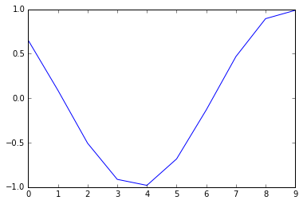
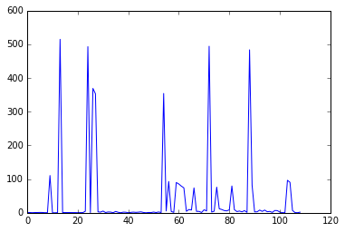

# Minimum search with DQN - keras

[20180131-DQN-keras-refine.ipynb](20180131-DQN-keras-refine.ipynb)

[20180131-DQN-keras-refine.py](20180131-DQN-keras-refine.py)

- Objective

  - find the minimum in an unknown function 

- Toolkit

  - keras >= 2.0
  - python 2.7, but I guess 3.5 is workable
  - matplotlib, numpy

- Environment

  - Create one with some random coefficient, the minimum appear at x=4 

     

  - action_space = [ '+', '-' ] ,   `0` : go right , `1` : go left

  - state_space = {`0`,` 1`, ...., `9`}  input range of x

- Agent 

  - An agent with Deep Q-learning is applied

- Result 

  - Loss is not stable

  

- Future Work 

  - Use policy gradient 
  - Modify reward function

